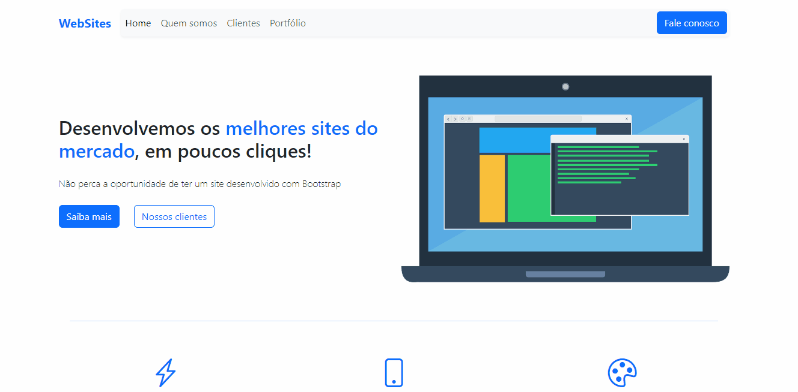

<h1 align="center">WebSites (Landing-page)</h1>
<h4 align="center">Landing page de uma empresa que oferece serviços de desenvolvimento de sites</h4>
<h4 align="center">Feito com HTML e Bootstrap</h4>

 &#xa0;

**
Sumário
**

<a href="#dart-sobre">Sobre</a> &#xa0; | &#xa0;
<a href="#books-O-que-eu-aprendi">O que aprendi</a> &#xa0; | &#xa0;
<a href="#white_check_mark-funcionalidades">Funcionalidades</a> &#xa0; | &#xa0;
<a href="#computer-tecnologias">Tecnologias</a> &#xa0; | &#xa0;
<a href="#hammer_and_wrench-serviços">Serviços</a>

<a href="#camera-imagens">Imagens</a> &#xa0; | &#xa0;
<a href="#scroll-pré-requisitos">Pré-requisitos</a> &#xa0; | &#xa0;
<a href="#link-links">Links</a> &#xa0; | &#xa0;
<a href="#sparkles-autor">Autor</a>

 &#xa0;
 
## :dart: Sobre

O principal objetivo do projeto foi aprender a utilizar o framework Bootstrap, para auxiliar no desenvolvimento de aplicações responsivas.

&#xa0;

## :books: O que eu aprendi?

📌 Vantagens de utilizar o framework Bootstrap;

📌 Como utilizar o Bootstrap;

📌 Como utilizar o Bootstrap icons;

📌 Deixar a aplicação responsiva com o Bootstrap.

&#xa0;

## :white_check_mark: Funcionalidades
A principal funcionalidade do projeto é:

✔️ Landing page da empresa fictícia "WebSites".

&#xa0;

## :computer: Tecnologias
* [HTML](https://developer.mozilla.org/pt-BR/docs/Web/HTML)

* [Bootstrap](https://getbootstrap.com/)

&#xa0;

## :hammer_and_wrench: Serviços
* <a href="https://github.com/">GitHub</a>

* <a href="https://www.netlify.com/">Netlify </a>- hospedagem

&#xa0;

## :camera: Imagens
**
Dispositivo desktop:
**

  

**
Dispositivo mobile:
**

  

&#xa0;

## :scroll: Pré requisitos
Para acessar a página, basta um navegador de sua preferência e conexão com internet.

&#xa0;

## :link: Links
* Repositório: https://github.com/CaioAugustoHD/WebSites-landing-page
* Deploy: https://bootstrapwebsites.netlify.app/

&#xa0;

## :sparkles: Autor

<h4>Feito por Caio Augusto Pereira</h4>

&#xa0;

 

